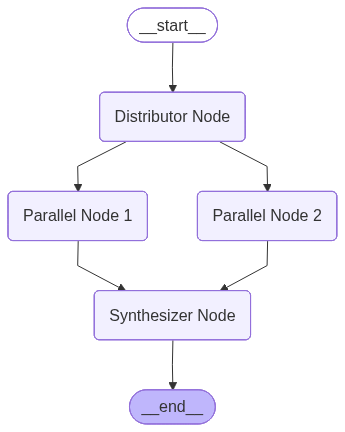

# Workflow Patterns in LLM Systems

Static, reusable structures that chain, route, or parallelize LLM steps. Implemented with LangGraph's `StateGraph`, nodes, and edges (`invoke()` / `ainvoke()`).

| Pattern | Essence |
|--------|--------|
| **1. Sequential Chaining** | Step A → Step B → Step C |
| **2. Routing** | One input → one of many paths |
| **3. Parallelization** | Fan-out → process → aggregate |

---

## 1. Sequential Chaining

**Step A → Step B → Step C.** Steps run in order; each node's output is the next node's input. No branches—linear pipeline: Node 1 → Node 2 → … → END. State: e.g. `original_text`, `summary`, `translation`, `current_step`.

**Use cases:** Document writing (outline → verify alignment → generate); multi-step data processing (extract → transform → summarize).

*Implementation:* `Sequential Chaining/langgraph_chaining.py`

---

## 2. Routing

**One input → one path.** A router (rule-based or LLM) inspects input and chooses one branch—e.g. Billing / Operations / Technical Support for tickets, or small vs. large model by query complexity. State: `query`, `decider`/`route`, result fields. Use `add_conditional_edges` to map decision to next node.

**Use cases:** Customer support routing; model selection (simple → small model, complex → reasoning model).

*Implementation:* `Workflow Routing/langgraph_routing.py`

---

## 3. Parallelization

**Fan-out → process → aggregate.** Distributor fans out to multiple nodes; each does independent work (e.g. subqueries, document chunks); synthesizer aggregates (e.g. reducer `Annotated[list, add]`) and optionally calls an LLM for a final summary.

**Use cases:** RAG with subqueries (parallel retrieval → merge and rank); long-document summarization (summarize chunks in parallel → aggregate).

*Implementation:* `Parallelization/langgraph_parallelization.py`

---

## Summary

Static workflows fit tasks where the execution path is known in advance. Tools like [n8n](https://n8n.io/), [Zapier](https://zapier.com/), and [UnifyApps](https://www.unifyapps.com/) offer visual/low-code design for these patterns.

**Code:** [Workflow-Patterns on GitHub](https://github.com/prabhatkgupta/Workflow-Patterns/)
